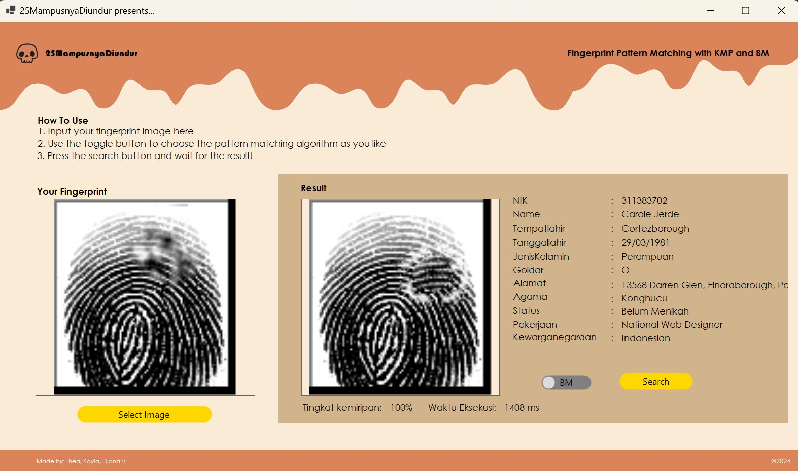

# Tubes3_25MampusnyaDiundur
# Fingerprint Detection Using Pattern Matching

## Table of Contents 💫
* [Brief Overview](#brief-overview) 👾 
* [The Algorithms](#the-algorithms) 👾 
* [Tools](#tools-and-libraries) 🔨
* [Requirements](#requirements) 🫧
* [Setting Up](#setting-up) 🍀
* [How To Use](#how-to-use) 🪄

## Brief Overview 
The program takes a fingerprint image input (.BMP) that needs to be matched with existing fingerprint images stored in a SQL database. It uses pattern matching algorithms (KMP, BM, and Regular Expression) to compare the inputted fingerprint image with the images in the database records.
The fingerprint database are obtained from https://www.kaggle.com/datasets/ruizgara/socofing.

## The Algorithms
Knuth Morris Pratt (KMP)
KMP is a string matching algorithm that efficiently finds occurrences of a pattern within a longer text by exploiting the information gathered during previous comparisons.
- Preprocess the pattern to construct a partial match table (also known as failure function) that indicates the longest proper prefix of the pattern that is also a suffix. This helps in avoiding unnecessary backtracking during the matching process.
- Start matching from the beginning of the text and the pattern.
- Compare characters of the text and the pattern. If a mismatch occurs, use the information from the partial match table to determine how much to shift the pattern.
- Continue matching until the end of the text is reached or a complete match is found.

Boyer Moore (BM)
Boyer-Moore is another string matching algorithm that efficiently searches for occurrences of a pattern within a longer text by utilizing two key heuristics: the bad character rule and the good suffix rule
- Preprocess the pattern to construct two lookup tables: the bad character table and the good suffix table. These tables provide information about character mismatches and potential shifts during the matching process.
- Begin matching from the end of the pattern and the end of the current window in the text.
- Compare characters of the pattern and the text from right to left. If a mismatch occurs:
Use the bad character rule to shift the pattern to align the mismatched character with the corresponding character in the text.
If the mismatched character does not occur in the pattern, use the good suffix rule to determine the maximum shift based on the matched suffix.
- Continue matching until the end of the text is reached or a complete match is found.

## Tools and Libraries
- Visual Studio
- WinForms
- "Anything SQL"

## Requirements
- Bogus
- Emgu
- NET 8.0

You have to install the requirements above in your Nuget Packages!!
To install:
1. Open the solution in Visual Studio
2. Right click on WinFormsApp1 and select Manage NuGet Packages
3. Browse the following packages and install all of them, ensure you have all of them applied
4. You're set!

Also make sure to setup your Visual Studio and SQL ready

## Setting Up
- Clone this repository on your terminal `https://github.com/pandaandsushi/Tubes3_25MampusnyaDiundur` and make sure you have all packages required installed
- Open Visual Studio and open the solution (WinFormsApp1.sln)
- Create a SQL database called `fingerprint` and fill it with the sql file provided `tubes3_stima24.sql` inside the src folder. But you can also use your own sqldump
- Make sure the connection string database name matches with your database and change the password as your own password.
- Click the execute button (green arrow) on the windows top menu

## How To Use
- Input your fingerprint image by using the Select Image button
- Use the toggle button to select algorithm between KMP and BM, default is BM
- Press the Search button to begin the search!
- Please wait until the result is displayed 

## Thankyou for trying our program :>

| Names                     | NIM      |
| ----------------------    |:--------:|
| Diana Tri Handayani       | 13522104 |
| Thea Josephine H          | 13522012 |
| Kayla Namira M            | 13522050 |
